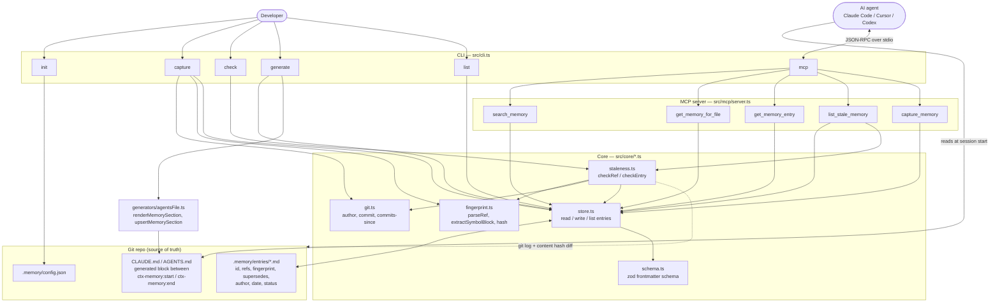
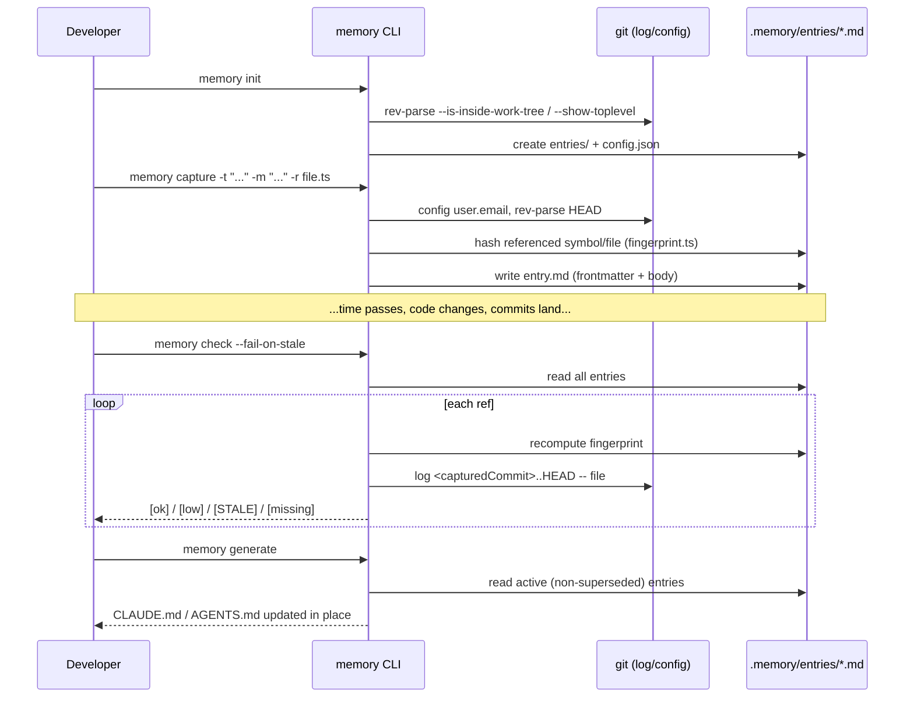
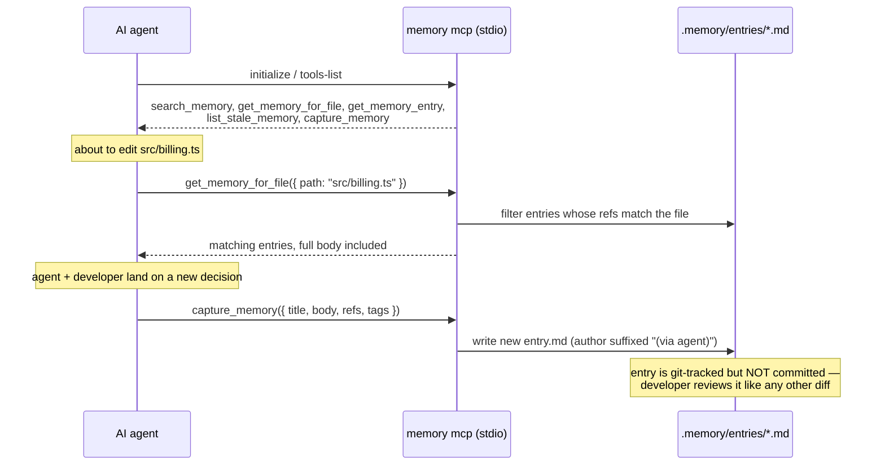
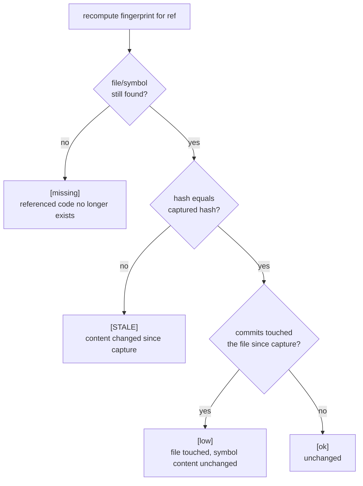

# ctx-memory — End-to-End Documentation

How the tool is put together, what every feature does, and how they fit together at runtime.
For a quick command reference see [README.md](./README.md); for the product/business framing
these decisions came from, see
[`Project Memory Layer — Idea & Tooling Review.md`](./Project%20Memory%20Layer%20—%20Idea%20&%20Tooling%20Review.md)
and [`SaaS Product Strategy.md`](./SaaS%20Product%20Strategy.md).

## Table of contents

1. [What this is](#1-what-this-is)
2. [Feature map](#2-feature-map)
3. [Architecture diagram](#3-architecture-diagram)
4. [End-to-end workflow](#4-end-to-end-workflow)
5. [Component deep-dive](#5-component-deep-dive)
6. [The memory entry format](#6-the-memory-entry-format)
7. [Staleness detection, in detail](#7-staleness-detection-in-detail)
8. [CLAUDE.md / AGENTS.md generation](#8-claudemd--agentsmd-generation)
9. [MCP server](#9-mcp-server)
10. [Repo file map](#10-repo-file-map)
11. [Testing strategy](#11-testing-strategy)
12. [Scope: what's built vs. what's future](#12-scope-whats-built-vs-whats-future)

---

## 1. What this is

`ctx-memory` is a local-first, git-backed memory layer for AI coding agents. It captures
*why* a decision was made — not just what the code does — as small markdown files, checks
whether that reasoning has drifted from the code it describes, and feeds it back to a
developer or an agent (Claude Code, Cursor, Codex, …) at the moment it's relevant.

It is the **Free / OSS tier** scoped in `SaaS Product Strategy.md` §5: storage, capture, and
local (fast-tier) staleness detection. Everything here runs on your machine against your
existing git repo — no server, no account, no network calls.

Three design principles run through every component, carried over from the idea review doc:

| Principle | Where it shows up |
| --- | --- |
| Write friction kills memory systems | `memory capture` is one command; interactive prompts only ask what's missing |
| Untrusted memory is worse than no memory | Every entry carries `author`, `date`, `commit` provenance, and a staleness check |
| Retrieval should be anchored, not injected | The MCP server serves entries for the file being touched, not the whole store on every turn |

---

## 2. Feature map

| Feature | Command / tool | What it does |
| --- | --- | --- |
| Store initialization | `memory init` | Creates `.memory/entries/` and `.memory/config.json` in the current git repo |
| Capture | `memory capture` | Records a decision as a new markdown entry — interactively, or fully via flags for scripting |
| Supersede | `memory capture --supersedes <id>` | Marks a prior entry `superseded` and links the new one to it — a semantic conflict becomes a normal PR review, not a silent overwrite |
| Staleness check (fast tier) | `memory check` | Re-fingerprints every entry's refs and cross-checks git history; flags drift with no LLM call |
| CI / pre-commit gate | `memory check --fail-on-stale` | Exit code 1 if anything is flagged — wire into CI or a git hook |
| Doc generation | `memory generate` | Renders active entries into `CLAUDE.md` and/or `AGENTS.md`, scoped to a marker block |
| Browsing | `memory list` | Lists entries, optionally filtered by tag |
| Agent integration | `memory mcp` | Runs an MCP server over stdio exposing memory to any MCP-compatible agent |
| Anchored retrieval | MCP `get_memory_for_file` | Returns entries anchored to the file an agent is about to edit |
| Search | MCP `search_memory` | Keyword search over titles/body, optional tag filter |
| Agent-driven capture | MCP `capture_memory` | Lets an agent propose an entry mid-session; written straight to a git-tracked file for human review at commit time, never auto-committed |
| Live staleness | MCP `list_stale_memory` | Lets an agent self-check whether the memory it's about to rely on is still trustworthy |

---

## 3. Architecture diagram



Everything left of the dotted line runs entirely on disk against the git repo you're already
in — there is no hosted component here (that's the separate SaaS control plane scoped in
`SaaS Product Strategy.md` §7, intentionally not built as part of this tool).

---

## 4. End-to-end workflow

A typical loop, and the sequence of calls behind it:



And the agent-facing loop, once `memory mcp` is registered with an MCP-compatible tool:



Concretely, day to day:

1. **Once per repo**: `memory init`.
2. **At the end of a task**, whenever a non-obvious decision was made: `memory capture`
   (interactively, or non-interactively from a script / an agent's `capture_memory` tool call).
3. **Before committing** (ideally via a pre-commit hook, see README): `memory check --fail-on-stale`
   so drifted entries get caught before they mislead the next reader.
4. **After capturing** (or periodically): `memory generate` so `CLAUDE.md`/`AGENTS.md` reflect
   the latest entries — this is what an agent reads passively at the start of a session.
5. **Continuously, while coding with an agent**: `memory mcp` running in the background gives
   the agent anchored retrieval (`get_memory_for_file`) instead of relying only on the static,
   generated snapshot.

---

## 5. Component deep-dive

### `src/core/schema.ts`
Zod schema for entry frontmatter (`MemoryFrontmatterSchema`) and the fingerprint shape
(`FingerprintEntrySchema`). This is the single source of truth for what a valid entry looks
like — every read and write goes through `.parse()`, so a malformed or hand-edited entry
fails loudly instead of silently propagating bad data.

### `src/core/store.ts`
Filesystem access for the memory store: `initStore`, `writeEntry`, `readEntryFile`,
`listEntries`, `findEntryById`, `updateEntryFrontmatter`. Entries are named
`<date>-<slug>-<id>.md` so they sort chronologically in a plain file listing even without
tooling. Uses `gray-matter` to parse/stringify YAML frontmatter + markdown body.

### `src/core/git.ts`
Thin wrapper over `git` via `child_process.execFile` (no `simple-git` dependency needed):
`getGitAuthor`, `getCurrentCommit`, `getRepoRoot`, `isGitRepo`, and `countCommitsSince` — the
last one is what powers the "N commits touched this file since capture" signal.

### `src/core/fingerprint.ts`
Parses a ref like `src/billing.ts#calculateTax` into `{ file, symbol }`
(`parseRef`), then either:
- hashes the whole file (no `#symbol`), or
- best-effort extracts just that symbol's source block (`extractSymbolBlock`) and hashes that.

Symbol extraction handles two shapes:
- **Brace-delimited** (JS/TS/Go/Java/…): finds the declaration line via a regex covering
  `function foo`, `class Foo`, `const/let/var foo =`, and `def foo` forms, then scans up to
  50 lines ahead for the opening `{` and matches braces to find the end. The 50-line window
  matters — a shorter one (an earlier version used 5) silently truncates multi-parameter
  TypeScript signatures to just the declaration line, which was caught by dogfooding this
  tool on itself (see `staleness` tag entries in `.memory/entries/`).
- **Indentation-delimited** (Python): if the declaration line ends in `:` with no `{`, it
  captures every following line with greater indentation.

If neither the file nor the symbol can be found, the fingerprint comes back `kind: "missing"`
rather than throwing, so a rename or deletion becomes a staleness signal instead of a crash.

### `src/core/staleness.ts`
`checkRef` compares a freshly computed fingerprint against the one stored at capture time and
combines it with `countCommitsSince` to produce one of four levels (see §7). `checkEntry` runs
this over every ref on an entry and rolls up to the worst level found; `checkEntries` does this
for a whole list in parallel.

### `src/generators/agentsFile.ts`
`renderMemorySection` groups active (non-superseded) entries by tag and renders a markdown
block; `upsertMemorySection` writes that block into a target file between
`<!-- ctx-memory:start -->` / `<!-- ctx-memory:end -->` markers — creating the file if it
doesn't exist, replacing only the marked region if it does, and appending a new marked region
if the file exists but has never had one. This is what lets `CLAUDE.md` carry both your own
hand-written instructions and a machine-managed memory section without one clobbering the other.

### `src/mcp/server.ts`
Wraps the four core operations (search, anchored lookup, staleness check, capture) as MCP
tools using `@modelcontextprotocol/sdk`'s `McpServer` + `StdioServerTransport`. Every tool
returns JSON as a single text content block, keeping responses easy for an agent to parse
without a custom result schema.

### `src/cli.ts`
`commander`-based entry point wiring each command module to a subcommand and its flags. Thin
by design — all real logic lives in `core/`, `generators/`, and `mcp/`, so the CLI and the MCP
server can both call the same functions without duplicating behavior.

---

## 6. The memory entry format

```markdown
---
id: mem_0_1s55r4
title: Chose Postgres over Mongo for billing
date: 2026-09-19
author: kishore.k@dataflo.ai
tags: [architecture, billing]
refs: [src/billing.ts#calculateTax]
supersedes: null
status: active
commit: 8f3a1c2
fingerprint:
  src/billing.ts#calculateTax: { hash: 7ac9f1e2b3d4c5a6, kind: symbol }
last_checked: null
---

Needed multi-document transactions for tax reconciliation; Mongo's driver didn't
support that in our deployed version.
```

| Field | Meaning |
| --- | --- |
| `id` | `mem_` + nanoid, assigned at capture, stable for the life of the entry |
| `title` | One-line summary, shown in `list`, `check`, and generated docs |
| `date` | Capture date (`YYYY-MM-DD`), also used in the filename for chronological sort |
| `author` | `git config user.email` (falls back to `user.name`); MCP-captured entries are suffixed `(via agent)` |
| `tags` | Free-form; drives grouping in generated `CLAUDE.md`/`AGENTS.md` |
| `refs` | Anchors — `path/to/file.ext` or `path/to/file.ext#symbolName` |
| `supersedes` | Id of a prior entry this one explicitly replaces |
| `status` | `active`, `stale` (set by `check --write`), or `superseded` (set by a later `capture --supersedes`) |
| `commit` | HEAD at capture time — the baseline `checkRef` diffs forward from |
| `fingerprint` | Per-ref `{ hash, kind }` captured at write time; `kind` is `symbol`, `file`, or `missing` |
| `last_checked` | ISO timestamp, only set when `check --write` is used |

One file per entry, plain markdown, git-diffable and git-blameable — no database, no binary
format, no migration step to read an old entry.

---

## 7. Staleness detection, in detail

`memory check` is the fast tier described in the SaaS strategy doc's two-tier design — pure
hash + git-log diffing, free, runs on every commit, no LLM involved. For each ref on an
active entry:



An entry's overall level is the worst level across all of its refs. `[STALE]` and `[missing]`
are what `--fail-on-stale` treats as a failure; `[low]` is informational — the file moved but
the thing the entry actually talks about didn't, so it's usually still trustworthy.

Note what this deliberately does **not** do: it never calls an LLM to judge whether the
entry's *meaning* still matches the code. That semantic diff — "does this decision's
reasoning still hold given what actually changed" — is the metered "slow tier" scoped as a
hosted, paid feature in the strategy doc, out of scope for this local tool by design.

---

## 8. CLAUDE.md / AGENTS.md generation

`memory generate` reads every entry whose `status` isn't `superseded`, groups them by tag,
and renders one bullet per entry (title, date, refs, tags, first line of body). That block is
written between `<!-- ctx-memory:start -->` and `<!-- ctx-memory:end -->` markers:

- **File doesn't exist** → created with just the marked section.
- **File exists, no markers** → the section is appended at the end; everything already there
  is left untouched.
- **File exists with markers** → only the content between them is replaced.

This means you can hand-write project instructions above or below the block, run
`memory generate` as often as you like, and never lose the hand-written part.

---

## 9. MCP server

`memory mcp` starts an MCP server over stdio (`StdioServerTransport`) so any MCP-compatible
agent can query memory live instead of only reading the static generated snapshot.

| Tool | Input | Purpose |
| --- | --- | --- |
| `search_memory` | `{ query?, tag? }` | Keyword search over active entries |
| `get_memory_for_file` | `{ path }` | Anchored retrieval — entries whose refs match this file |
| `get_memory_entry` | `{ id }` | Full entry content by id |
| `list_stale_memory` | `{}` | Runs the fast-tier check, returns only flagged entries |
| `capture_memory` | `{ title, body, refs?, tags? }` | Agent-initiated capture — writes a git-tracked file, never commits |

### Registering the server per tool

Each of these three files already exists in this repo, committed, pointing at
`npx tsx src/cli.ts mcp` (runs straight from source, no build step) — copy the shape into any
other project's own config, swapping the `args` for wherever `ctx-memory` actually lives there
(a built `dist/cli.js` for a consuming repo, or a globally-linked `memory mcp` command).

**Claude Code** — project-scope `.mcp.json` at the repo root, committed so everyone who clones
the repo gets it automatically:

```json
{
  "mcpServers": {
    "ctx-memory": {
      "command": "npx",
      "args": ["tsx", "src/cli.ts", "mcp"]
    }
  }
}
```

Equivalently: `claude mcp add --scope project --transport stdio ctx-memory -- npx tsx src/cli.ts mcp`.

**Cursor** — same JSON shape, at `.cursor/mcp.json` instead of `.mcp.json`.

**Codex CLI** — different format: TOML, not JSON, at `.codex/config.toml`, under an
`[mcp_servers.<name>]` table:

```toml
[mcp_servers.ctx-memory]
command = "npx"
args = ["tsx", "src/cli.ts", "mcp"]
```

Codex only reads project-level config for projects you've explicitly trusted — run `codex
trust` on the repo once, or it'll prompt the first time it opens it.

### Getting an agent to actually call these tools

Registering the server only makes the tools *available* — it doesn't make an agent call them.
Nothing about MCP tool registration nudges an agent to check memory before editing a file or to
capture a decision after making one; that has to be a written instruction the agent reads. This
repo's own `CLAUDE.md` and `AGENTS.md` carry a hand-written "Working with project memory"
section, above the generated block, that spells out exactly when to call each tool (before
editing a file → `get_memory_for_file`; before a non-obvious choice → `search_memory`; after
landing on a decision → `capture_memory`; before trusting an entry → `list_stale_memory`). Copy
that section — not the generated block below it — into any repo where you want an agent to use
`ctx-memory` on its own initiative rather than only when the developer explicitly asks it to.

---

## 10. Repo file map

```
Context-Efficiency Tool/
├── src/
│   ├── cli.ts                    # commander entry point, wires commands to flags
│   ├── commands/
│   │   ├── init.ts               # memory init
│   │   ├── capture.ts            # memory capture (interactive + flag-driven)
│   │   ├── check.ts              # memory check (staleness report)
│   │   ├── generate.ts           # memory generate (CLAUDE.md/AGENTS.md)
│   │   └── list.ts               # memory list
│   ├── core/
│   │   ├── schema.ts             # zod frontmatter schema + types
│   │   ├── store.ts              # read/write/list memory entries on disk
│   │   ├── git.ts                # author, HEAD, commits-since helpers
│   │   ├── fingerprint.ts        # ref parsing, symbol extraction, hashing
│   │   └── staleness.ts          # checkRef / checkEntry / checkEntries
│   ├── generators/
│   │   └── agentsFile.ts         # render + marker-based upsert into CLAUDE.md/AGENTS.md
│   └── mcp/
│       └── server.ts             # MCP tools over stdio
├── tests/
│   ├── fingerprint.test.ts       # symbol extraction + hashing unit tests
│   ├── store.test.ts             # entry read/write/list round-trip
│   ├── agentsFile.test.ts        # marker create/append/replace behavior
│   └── staleness.test.ts         # integration tests against real temp git repos
├── .memory/                      # this repo's own dogfooded memory store
│   ├── config.json
│   └── entries/*.md
├── .mcp.json                     # Claude Code: registers the ctx-memory MCP server
├── .cursor/mcp.json              # Cursor: same server, Cursor's own config path
├── .codex/config.toml            # Codex CLI: same server, TOML format (needs `codex trust`)
├── CLAUDE.md / AGENTS.md         # generated by `memory generate`, checked in
├── README.md                     # install + command quickstart
├── ARCHITECTURE.md               # this file
├── Project Memory Layer — Idea & Tooling Review.md   # original product review
├── SaaS Product Strategy.md                          # SaaS-layer strategy (future scope)
├── package.json / tsconfig.json
└── dist/                         # build output (gitignored)
```

---

## 11. Testing strategy

22 tests across 4 files, run with `vitest`:

- **`fingerprint.test.ts`** — pure unit tests: ref parsing, hash determinism, symbol
  extraction across JS function declarations, TS arrow consts, Python `def` blocks, a
  multi-line-signature regression case, and the "symbol not found" fallback.
- **`store.test.ts`** — write → read round-trip, chronological listing, `findEntryById`,
  and frontmatter updates that preserve the body — all against a temp directory, no git
  needed (store logic itself doesn't touch git).
- **`agentsFile.test.ts`** — the three `upsertMemorySection` cases (create, append, replace-
  between-markers) plus `renderMemorySection`'s grouping and superseded-entry exclusion.
- **`staleness.test.ts`** — the only integration-style suite: spins up a real temporary git
  repo, commits real file changes, and asserts all four staleness levels (`fresh`, `high`,
  `low`, `missing`) come out correctly. This is what caught the multi-line-signature bug —
  it's real git history, not a mock.

---

## 12. Scope: what's built vs. what's future

Built here (Free/OSS tier, `SaaS Product Strategy.md` §5):

- Memory file spec, capture CLI, local fast-tier staleness check, `CLAUDE.md`/`AGENTS.md`
  generator, MCP server for multi-tool retrieval.

Explicitly not built, and why:

| Not built | Reason |
| --- | --- |
| Raw session-transcript extractor | Undocumented, per-vendor formats; killed in the original idea review |
| Custom secret scanner | Wrap gitleaks/trufflehog instead of reinventing one |
| Reading projectmem / basic-memory stores natively | Listed as a Free-tier goal in the strategy doc (§5) but not implemented yet — the entry format here is compatible in spirit (append-only markdown, git-backed) but there's no adapter code reading a projectmem-formatted store today. Worth revisiting before spending more effort on this tool's own format |
| Hosted control plane (dashboard, cross-repo aggregation, billing, SSO, RBAC, audit log) | This is the entire paid SaaS layer in §5–8 of the strategy doc — server-side by nature, requires real infrastructure and accounts, deliberately out of scope for a local-first tool |
| LLM-backed "slow tier" semantic staleness check | Metered, paid feature per the two-tier design — the fast tier here is the free half of that design, not a placeholder for it |
