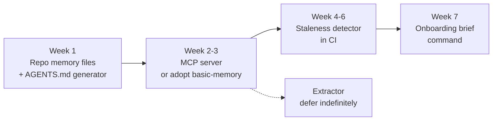

# Project Memory Layer — Idea & Tooling Review

2026-09-19 · @yo

## Verdict: 6.5 / 10

Real problem, sensible design, crowded field. Most of the value sits in two pieces you could finish in a weekend. Most of the risk sits in the piece that feels most impressive.

The score splits depending on what you want out of it:

| Use | Score | Why |
| --- | --- | --- |
| Internal tool for your team | 8 / 10 | Solves a problem you have, cheap to build, no competitor to beat |
| Portfolio or learning project | 8 / 10 | MCP + CI + LLM extraction in one project is a strong story |
| Commercial product | 4 / 10 | Free repo files below you, funded startups above you |

One thing moves this score up: **staleness detection**. Everything else in the design exists somewhere already. Memory that tells you when it has gone out of date does not.

## Scorecard

| Dimension | Score | Reasoning |
| --- | --- | --- |
| Problem is real | 9 / 10 | Every team adding a second developer to an AI-assisted codebase hits this. It is not hypothetical |
| Problem is felt | 6 / 10 | Real, but people route around it with a wiki and a call. Pain is chronic, not acute — which makes adoption slow |
| Novelty | 4 / 10 | Repo context files, memory servers, and code-Q&A tools all already claim this territory |
| Technical feasibility | 7 / 10 | Phases 1–2 are easy. Phase 3 depends on undocumented vendor formats. Phase 4 is genuinely hard |
| Differentiation | 6 / 10 | Staleness detection is the only real edge. Git-backed storage is a good choice but easy to copy |
| Commercial viability | 4 / 10 | Narrow willingness to pay; the free alternative is already 60% as good |
| Maintenance burden | 5 / 10 | Session-format churn means recurring breakage you did not choose |

### What the scores are saying

The gap between "problem is real" at 9 and "commercial viability" at 4 is the whole story. This is a genuine problem with a cheap partial fix already available for free. That kills it as a business and leaves it strong as an internal tool.

The gap between "feasibility" at 7 and "maintenance" at 5 is the second story. Building it is easier than keeping it alive.

## Component ratings

Build four of these six. Cut one, buy the other.

| Component | Value | Effort | Risk | Call |
| --- | --- | --- | --- | --- |
| Markdown memory files in repo | 9 / 10 | Very low | Very low | **Build first** |
| `AGENTS.md` / `CLAUDE.md` generator | 9 / 10 | Very low | Very low | **Build first** |
| MCP server | 9 / 10 | Medium | Low | **Build second** |
| Staleness detector in CI | 8 / 10 | High | Medium | **Build — this is the edge** |
| Onboarding brief generator | 7 / 10 | Low | Low | Build, it is nearly free once MCP exists |
| Session transcript extractor | 4 / 10 | High | **High** | **Cut, or defer indefinitely** |
| Secret scanner | Required | — | — | **Buy** — gitleaks or trufflehog, never write your own |

### Why the extractor scores lowest

It is the piece that sounds most like a product and behaves least like one.

- Vendor session formats are undocumented and unversioned; every tool update can break it
- Extraction quality is mediocre — the model cannot tell a decision from a dead end it never saw corrected
- Review fatigue kills it. Developers approve the first ten proposals carefully and rubber-stamp the rest
- It duplicates something cheaper: a person typing three sentences after finishing a task

If you want the capture step, make it a command the developer runs deliberately at the end of a task, summarising in their own words with the model tidying it. That gets 80% of the value with none of the format risk.

### Why staleness detection scores highest relative to effort

Every memory system fails the same way: the memory rots, someone gets burned by a wrong answer, and the team stops trusting it. Detecting rot is the difference between a tool that survives six months and one that does not. It is also the part nobody else has shipped well, which is exactly why it is worth your effort rather than your money.

## Existing tools, rated

| Tool or approach | Rating | Verdict |
| --- | --- | --- |
| `AGENTS.md` and per-tool context files | 9 / 10 | **Adopt today.** Free, in git, read by most tools, solves roughly 60% of the problem before you write a line of code |
| MCP as the integration layer | 9 / 10 | **Adopt.** The only thing that makes one memory store work across Claude Code, Codex and Cursor. This is the piece that makes your "switch back to Codex" scenario possible at all |
| basic-memory | 7 / 10 | **Try before building.** Markdown files over MCP is close to your design. If it fits, you have skipped two phases |
| Zep / Graphiti | 6 / 10 | Strong retrieval, temporal knowledge graph. Heavier than you need and aimed at agent memory, not team onboarding |
| mem0 | 6 / 10 | Easy to start, good API. Hosted by default, which fights your git-backed requirement |
| Letta | 5 / 10 | Agent-centric memory. Powerful, but the wrong abstraction for "what does this team know about this repo" |
| Sourcegraph / Greptile / Unblocked | 7 / 10 | **Complementary, not competing.** They answer questions about code. They do not hold decisions and rationale. Run alongside |
| Parsing raw session files | 2 / 10 | **Avoid.** Undocumented, per-vendor, breaks on updates. Interesting to explore, dangerous to depend on |

### The adopt-versus-build line

Draw it here: **adopt everything about storage and retrieval, build only the staleness layer.**

If basic-memory or a similar MCP memory server covers your storage, your project collapses from six components to two — a CI staleness checker and an onboarding brief command. That is a better project, not a smaller one. It does one thing nobody else does instead of five things several people already do.

Check current docs before committing to any of these. My knowledge runs to roughly May 2026 and this category is moving fast enough that a six-month-old assessment is unreliable.

## What caps the score

Ranked by how likely each is to end the project, not by how hard each is to explain.

| Limitation | Kill risk | Can you design around it? |
| --- | --- | --- |
| Nobody maintains it — memory rots like docs rot | **High** | Partly. Staleness detection plus low write friction is the entire mitigation |
| Write friction — capture is a manual step that gets skipped | **High** | Yes. Make it one command at task end, never a form |
| Trust — a new dev cannot tell a decision from a hallucination | **High** | Yes. Provenance on every entry: who wrote it, when, from what |
| Session formats are undocumented and change per release | High, but only for the extractor | Yes — by cutting the extractor |
| Secrets and customer data inside transcripts | High if it happens once | Yes. Scan before write, never after |
| Context rot — more injected memory measurably worsens answers | Medium | Yes. Retrieve a few entries, never inject the whole store |
| Token cost on every turn for every developer | Medium | Yes. Retrieval instead of always-on injection |
| No semantic merge for two developers' memories | Medium | Partly. Small append-only files conflict less |
| Access control — a contractor should not see everything | Medium | Yes, if storage is git. Repo permissions do the work |
| Model differences across tools | Low | Mostly. Short factual entries travel better than transcripts |
| Recency bias — captures what was recent, not what matters | Low | Partly. Human review at write time |
| Vendor terms on exporting session data | Low | Yes — by not touching session data |

### The pattern in that table

The three highest risks are human, not technical. None of them is solved by better code. They are solved by making writing cheap, making reading trustworthy, and making rot visible.

The second pattern: six of the twelve risks disappear entirely if you drop the transcript extractor. That is the strongest argument for cutting it.

## Recommendation

Build the narrow version. Adopt the rest.

Ship week 1 before designing week 4. The first step is useful on its own, which means you learn whether anyone on your team actually writes memory down before you invest in serving it.

### The three decisions

1. **Build:** the staleness detector. It is your only real differentiator and the reason the project outlives its first month.
2. **Adopt:** storage and retrieval. Try basic-memory or an equivalent MCP memory server before writing your own. If it fits, your project gets sharper.
3. **Never build:** the secret scanner, and — on current evidence — the session transcript extractor.

### How to know it is working

Set one number before you start: **how long a new developer takes to make their first correct non-trivial change.** Measure it once now, honestly. If the tool does not move it, the tool has failed regardless of how elegant it is.

A second signal worth watching: how many memory entries get written in month two versus month one. A drop means write friction beat you, and that is the failure mode that ends most of these projects.
