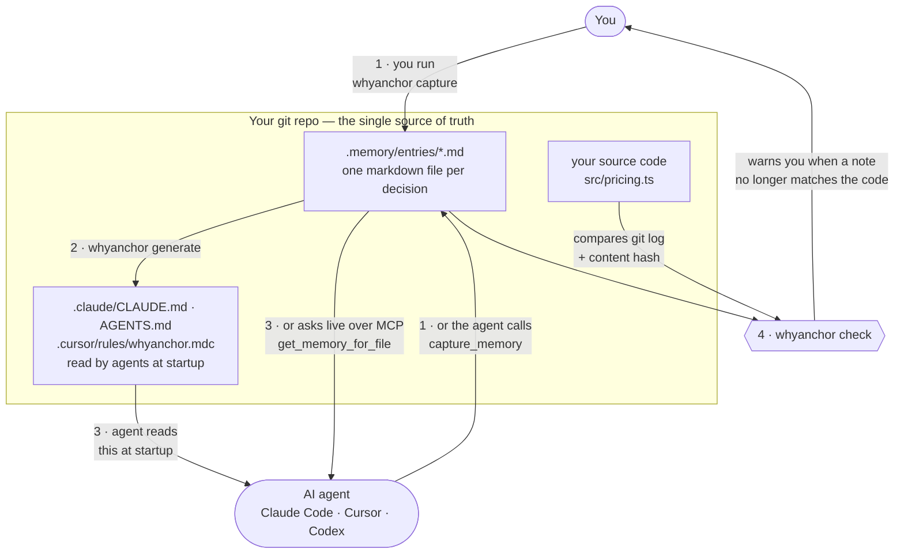
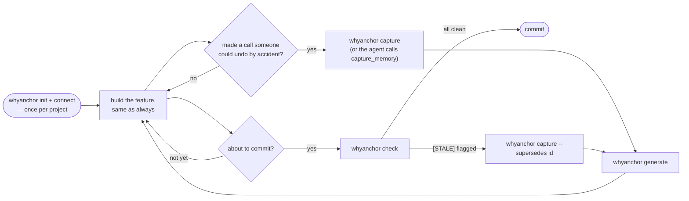
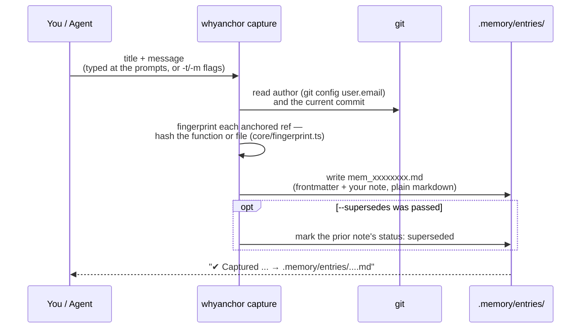
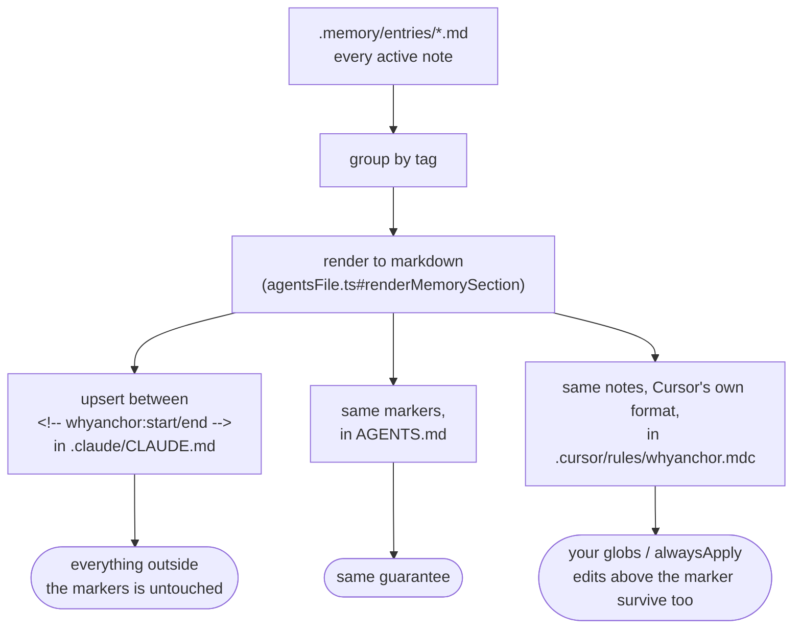
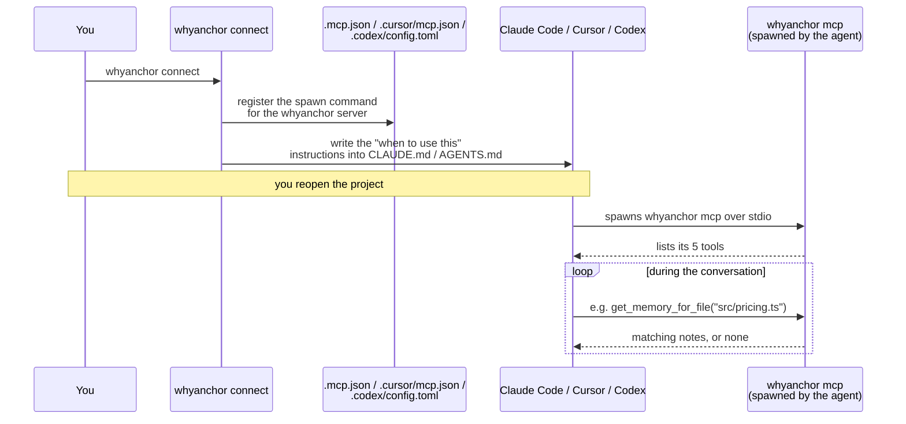
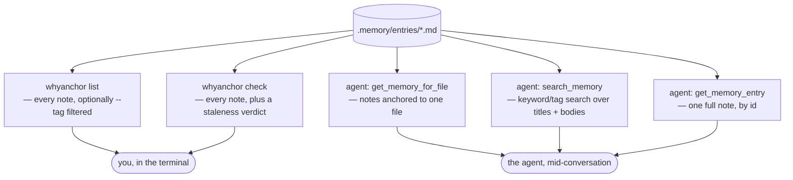
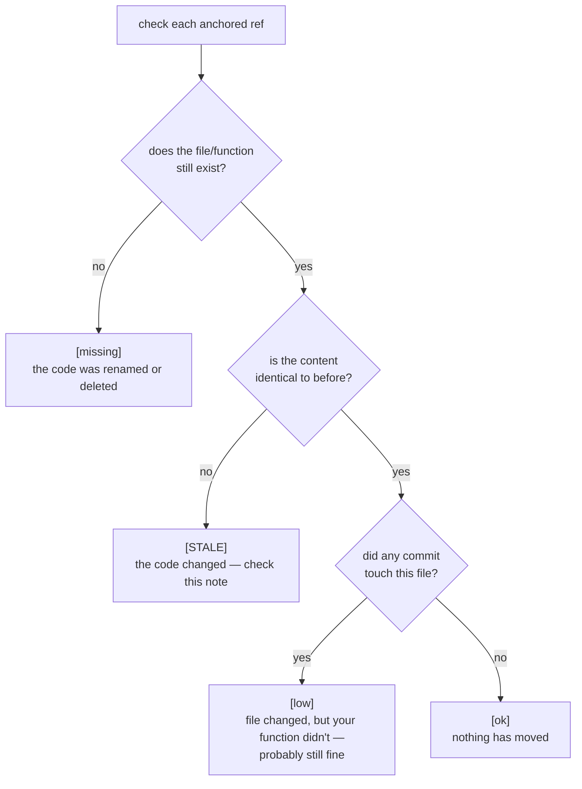

# whyanchor

**Your AI coding agent forgets why your code is the way it is. This remembers for it.**

A small command-line tool that stores project decisions as markdown files in your git repo, feeds
them to AI agents (Claude Code, Cursor, Codex) at the right moment, and warns you when a note no
longer matches the code it describes.

No server. No account. No network calls. Everything lives in your repo.

---

## Table of contents

- [The problem](#the-problem)
- [What this tool does](#what-this-tool-does)
- [Architecture](#architecture)
- [Install](#install)
- [Use it in 5 minutes](#use-it-in-5-minutes)
- [The day-to-day workflow](#the-day-to-day-workflow)
- [All commands](#all-commands)
- [How AI agents use it](#how-ai-agents-use-it)
- [Staleness detection: the main idea](#staleness-detection-the-main-idea)
- [Compared with existing tools](#compared-with-existing-tools)
- [What makes this one different](#what-makes-this-one-different)
- [When this tool is useful (and when it is not)](#when-this-tool-is-useful-and-when-it-is-not)
- [The memory file format](#the-memory-file-format)
- [Project layout](#project-layout)
- [Development](#development)
- [What is deliberately not built](#what-is-deliberately-not-built)

---

## The problem

Here is the whole problem in one story.

You set the enterprise discount to **30%**. You did that because **Legal signed a contract that
requires 30%** — not because it felt right.

```ts
if (tier === "enterprise") return total * 0.3;
```

Six months later, someone opens this file. Maybe a new teammate. Maybe an AI agent in a fresh
session that knows nothing about last year. They see `0.3` and think:

> "Let's try 0.35 for the Q4 push."

The code does not say why. `git blame` says *"update pricing."* Nobody remembers. The contract
gets broken by a one-character change.

**The reason was never written anywhere the next person would actually look.**

This happens constantly with AI agents, because every new session starts with zero memory of the
last one. You explain the same constraint again and again — and the one time you forget to, the
agent quietly undoes a decision you made on purpose.

---

## What this tool does

Three jobs, nothing more:

| # | Job | How |
| --- | --- | --- |
| 1 | **Remember** a decision | One command (`whyanchor capture`) writes it to a markdown file in your repo. Your agent can also write one itself, mid-conversation. |
| 2 | **Deliver** it to the agent at the right time | Two ways: written into the files agents read at startup (`.claude/CLAUDE.md`, `AGENTS.md`, Cursor's rules file), and served live over MCP so the agent can ask "what do I need to know about *this* file?" |
| 3 | **Keep it honest** | `whyanchor check` compares each note against the code it points at. If the code moved on, the note gets flagged. |

Job 3 is the important one. Every "write down your decisions" system dies the same way: the notes
rot, somebody gets burned by a wrong answer, and the team stops trusting the whole thing. A note
that tells you when it has gone out of date is the difference between a tool that lasts and one
that gets abandoned in month two.

---

## Architecture

Everything is files in your git repo. There is no database and no server. This is the end-to-end
picture — [the day-to-day workflow](#the-day-to-day-workflow) below zooms into each arrow one at a
time.



Following the numbers:

1. **A decision gets written down** — either you run one command, or the agent saves the note
   itself while you are working with it.
2. **Notes are rolled into the files agents already read** — `.claude/CLAUDE.md`, `AGENTS.md`,
   and Cursor's own rules file. One command writes all three.
3. **The agent gets the note two ways** — passively at startup from that file, and actively over
   MCP when it wants to know about one specific file it is editing.
4. **The tool checks its own notes against reality** — comparing the saved fingerprint to the
   current code and git history, and flagging the ones that no longer match.

---

## Install

Requires **Node.js 18+** and **git**. whyanchor is published on npm — there is nothing to clone
or build.

```bash
npx whyanchor init
```

Run that inside a git repo you actually work in. `npx` fetches the tool on first use, so this
works with zero setup. If you'd rather have `whyanchor` on your PATH permanently:

```bash
npm install -g whyanchor
whyanchor init
```

Every example in this README is written as `whyanchor <command>`. If you skipped the global
install, prefix each one with `npx `.

---

## Use it in 5 minutes

Go to any git repo you actually work in:

```bash
cd ~/my-project
whyanchor init      # creates .memory/ to hold your notes
whyanchor connect   # wires the tool into Claude Code, Cursor, and Codex
```

That is the entire setup. `whyanchor connect` writes the config files your agents need and adds a
short instruction block to `.claude/CLAUDE.md` and `AGENTS.md` telling the agent when to use it. It
**merges** into any config you already have — it never overwrites other MCP servers, and if it
cannot understand a config file it stops rather than damaging it.

Now save your first decision. Just run the command with no flags — it asks you the questions:

```bash
whyanchor capture
```

```
√ One-line title for this memory:
  Enterprise discount is 30% by contract, not a guess

√ What should future you (or another dev) know? (a few sentences)
  Legal signed off on 30% in the 2026 MSA template. Do not change this for conversion
  experiments without contract review.

√ Files/symbols this is anchored to (comma-separated, e.g. src/billing.ts#calculateTax)
  src/pricing.ts#calculateDiscount

√ Tags (comma-separated, optional)
  pricing, legal

✔ Captured "Enterprise discount is 30% by contract, not a guess"
  → .memory/entries/2026-09-21-enterprise-discount-is-30-by-contract-not-a-guess-mem_a8AwCAoR.md
```

The third question — **anchoring** the note to `src/pricing.ts#calculateDiscount` — is the part
that matters most. That anchor is what makes staleness detection possible later.

Writing a script, a git hook, or capturing from CI instead of a terminal? Skip the prompts by
passing the same answers as flags:

```bash
whyanchor capture \
  -t "Enterprise discount is 30% by contract, not a guess" \
  -m "Legal signed off on 30% in the 2026 MSA template. Do not change this for conversion experiments without contract review." \
  -r "src/pricing.ts#calculateDiscount" \
  --tags pricing,legal
```

Any flag you provide is skipped in the prompt; leave one out and `capture` still asks for just
that one.

Finally, push it into the files your agents read at startup:

```bash
whyanchor generate
```

Now open that project in Claude Code, Cursor, or Codex. Ask it to change the discount. It will
already know why it is 30%.

### Which file does each agent read?

`whyanchor generate` writes three files, because the tools do not agree on one:

| File | Read by | Why this file |
| --- | --- | --- |
| `.claude/CLAUDE.md` | Claude Code | Claude Code reads a project CLAUDE.md from either the repo root or `.claude/`; this keeps the root clean |
| `AGENTS.md` | **Codex**, Cursor, Copilot, Gemini CLI, Windsurf, Zed and others | The vendor-neutral standard, now stewarded under the Linux Foundation and used by 60k+ projects |
| `.cursor/rules/whyanchor.mdc` | Cursor | Cursor reads `AGENTS.md` too, but this is its *native* rules format, which supports per-file scoping |

Two things worth knowing, because the naming trips people up:

- **There is no `Codex.md`.** Codex reads `AGENTS.md`. That file already covers it.
- **There is no `Cursor.md`.** Cursor uses `.cursor/rules/*.mdc` files, and the `.mdc` extension is
  required — a plain `.md` file dropped in that folder is silently ignored, because Cursor needs
  the YAML frontmatter to know when to apply the rule.
- **Don't keep a root `CLAUDE.md` as well.** Claude Code loads `./CLAUDE.md` *and*
  `./.claude/CLAUDE.md` when both exist, so a leftover root copy injects every note twice and
  wastes context. `whyanchor generate` warns you if it spots one.

Generate just one if you prefer:

```bash
whyanchor generate --target claude   # only .claude/CLAUDE.md
whyanchor generate --target agents   # only AGENTS.md
whyanchor generate --target cursor   # only the Cursor rules file
whyanchor generate --target all      # all three (the default)
```

### Tuning the Cursor rule

The `.mdc` file is created with frontmatter that applies it to every request:

```yaml
---
description: Project memory — decisions and the reasoning behind them, captured with whyanchor
alwaysApply: true
---
```

If your memory grows large and you only want it loaded for certain files, edit that frontmatter —
swap `alwaysApply: true` for a `globs` pattern:

```yaml
---
description: Project memory
globs: ["src/billing/**", "src/pricing.ts"]
alwaysApply: false
---
```

Your edits to the frontmatter are preserved. `whyanchor generate` only rewrites the notes below it.

---

## The day-to-day workflow

`init` and `connect` are one-time setup. Everything below is what actually recurs, week to week.

| When | What you run | Why |
| --- | --- | --- |
| You just made a decision someone could undo by accident | `whyanchor capture` | ~20 seconds, interactive by default |
| Mid-conversation with an agent | Nothing — the agent calls `capture_memory` itself | That's the point of wiring up MCP |
| After a batch of captures, or before opening the project in your agent | `whyanchor generate` | Rolls new notes into `CLAUDE.md` / `AGENTS.md` / Cursor's rules file |
| Right before you commit | `whyanchor check` (or the git hook below) | Catches notes that silently went stale because of this change |
| A note comes back `[STALE]` | `whyanchor capture --supersedes <id>` | Writes a corrected note; the old one stays in git history, marked superseded — never edited in place |

The five diagrams below cover, respectively: the loop above end to end, then each of its steps in
more detail — how a note gets written, how it gets back out to an agent (two different ways), and
how an agent finds it during a conversation.

### Developer workflow flow



### Memory capture flow

What actually happens inside `whyanchor capture`, whether you answer the prompts or pass flags:



Nothing here touches git itself — the file is written and left staged-or-not, exactly like any
other change you made by hand. You review and commit it the same way.

### Context injection flow

What `whyanchor generate` does to get a note in front of an agent that has no MCP support (or
before it has even started a session):



The replacement is marker-scoped and line-exact, not a full-file rewrite — so a hand-written note
above the block, or a note whose own body happens to contain marker-like text, cannot corrupt the
file.

### MCP integration flow

What `whyanchor connect` sets up, and what happens live once the agent is running:



If you installed with `npm install -g`, the command `connect` registers is stable. If you're
running the tool via bare `npx whyanchor`, pass `--command "npx -y whyanchor mcp"` explicitly when
connecting — `npx`'s own cache is pruned periodically, and a config pointed at that cache's
temporary path can stop resolving later.

### Memory retrieval flow

Five different ways a note comes back out of `.memory/entries/`, depending on who's asking:



### Run the check automatically

Put this in `.git/hooks/pre-commit` and make it executable:

```bash
#!/bin/sh
whyanchor check --fail-on-stale || {
  echo "Some memory notes look stale — run 'whyanchor check' to see them."
  exit 1
}
```

`--fail-on-stale` exits with code `1` when something is flagged, so it also works as a CI step.

---

## All commands

| Command | What it does |
| --- | --- |
| `whyanchor init` | Creates `.memory/` in the current git repo. Run once per project. |
| `whyanchor connect` | Registers the tool with Claude Code, Cursor and Codex, and writes agent instructions into `CLAUDE.md`/`AGENTS.md`. |
| `whyanchor capture` | Saves a new decision. Interactive, or scripted with flags. |
| `whyanchor generate` | Writes your notes into `.claude/CLAUDE.md`, `AGENTS.md`, and `.cursor/rules/whyanchor.mdc`. |
| `whyanchor check` | Compares every note against the current code. Reports what has gone stale. |
| `whyanchor list` | Shows all saved notes. |
| `whyanchor mcp` | Runs the MCP server. **Agents run this, not you.** |

Useful flags:

```bash
whyanchor capture --supersedes mem_ab12cd34   # replace an outdated note
whyanchor check --fail-on-stale               # exit 1 if stale (for CI / git hooks)
whyanchor check --json                        # machine-readable output
whyanchor check --write                       # save the check result into the note files
whyanchor generate --target cursor            # only one target: claude | agents | cursor | all
whyanchor list --tag pricing                  # filter by tag
whyanchor connect --agent claude,cursor       # only wire up some agents
whyanchor connect --command "whyanchor mcp"   # override how the server is launched
```

---

## How AI agents use it

`whyanchor connect` sets this up for you. Here is what it actually configures.

**The config files it writes:**

| Agent | File | Format |
| --- | --- | --- |
| Claude Code | `.mcp.json` | JSON, picked up automatically when the project opens |
| Cursor | `.cursor/mcp.json` | Same JSON shape |
| Codex CLI | `.codex/config.toml` | TOML — a different format. Also needs `codex trust` on the repo once. |

**The five tools your agent gets:**

| Tool | When the agent uses it |
| --- | --- |
| `get_memory_for_file` | Before editing a file — "what do I need to know about this one?" |
| `search_memory` | Before a big decision — "has this already been decided?" |
| `get_memory_entry` | To read one note in full |
| `list_stale_memory` | To check whether a note can still be trusted |
| `capture_memory` | To save a new decision during your conversation |

### The part people get wrong

Registering the tools only makes them **available**. It does not make an agent **use** them. An
agent will not think to check your notes unless something tells it to.

That is why `whyanchor connect` also writes a short instruction block into `CLAUDE.md`/`AGENTS.md`:

> - **Before editing a file**, call `get_memory_for_file` with its path.
> - **Before a non-obvious choice**, call `search_memory` first.
> - **When you land on a decision worth remembering**, call `capture_memory`.

Without that block, the tools sit there unused. With it, the agent checks your notes on its own.

### Agent-written notes are safe

When an agent calls `capture_memory`, it writes a normal file into `.memory/`. It **never commits
anything**. The note shows up in `git diff` like any other change, and you approve it the same way
you approve code. Nothing enters your project's history without you looking at it.

---

## Staleness detection: the main idea

This is the part that other note-taking approaches do not do.

When you save a note, the tool records a **fingerprint**: a hash of the exact function or file you
anchored to, plus the current git commit. Later, `whyanchor check` recomputes that fingerprint and
compares.



Why four levels instead of just "stale / not stale"? Because a file-level check cries wolf. If
someone edits a different function in the same file, a naive tool flags your note and you learn to
ignore the warnings. Anchoring to `src/pricing.ts#calculateDiscount` means you are only alerted
when **that function** actually changed.

Real example from this repo: a refactor split one function into two. `whyanchor check` flagged the
note pointing at the old one, the note got superseded with a corrected anchor, and the
documentation stayed true. That is the loop working.

**No AI is involved in this check.** It is hashes and `git log` — fast, free, and it runs on every
commit. It tells you *that* something changed, not *whether the reasoning still holds*. A human
still makes that call.

---

## Compared with existing tools

Honest version, researched September 2026.

### Free things people already use

| Approach | What it gives you | Where it falls short |
| --- | --- | --- |
| **Hand-written `CLAUDE.md` / `AGENTS.md`** | Free, in git, read by nearly every AI tool. Genuinely solves ~60% of this problem with zero setup. | One growing file. Nothing tells you when a line has gone out of date. Everything gets loaded every time, whether relevant or not. |
| **Comments in the code** | Right next to the code | Nobody writes "we rejected Mongo because…" in a comment. Comments explain *what*, rarely *why not*. |
| **A wiki / Notion page** | Nice to read | Lives outside the repo, so the agent never sees it and it drifts silently. |
| **basic-memory** | Markdown notes over MCP — close to this design | General-purpose notes, not anchored to code, so no drift detection. |
| **projectmem** (MIT, free) | Native MCP across major agents, append-only event log, **and it ships staleness detection too** | The closest thing to this tool. If it fits you, use it — see the honesty note below. |

### Commercial tools

| Tool | What it is | Price |
| --- | --- | --- |
| **Swimm** | Docs that flag drift as a PR check — the paid version of the staleness idea | ~$39/month per team (≤10 users) |
| **Greptile** | Answers questions about your code, AI code review | Free tier (50 reviews/mo) → $30/seat/mo + $1/review |
| **Sourcegraph Cody** | Code intelligence and search | ~$59/seat/mo, enterprise only |
| **mem0** | Hosted memory API for AI apps | Free (10k memories) → $19/mo → $249/mo |
| **Zep / Graphiti** | Temporal knowledge graph for agent memory | Free (10k msgs) → ~$99–125/mo |
| **GitHub Copilot** | Code completion and chat | $19/seat/mo → $39/seat/mo |

The code-search tools (Greptile, Sourcegraph) are **not competitors** — they answer *"what does
this code do?"*. They do not hold *"why did we choose this, and what did we reject?"*. Run them
alongside this, not instead of it.

---

## What makes this one different

Five concrete design choices:

1. **Anchored to symbols, not files.** A note points at `pricing.ts#calculateDiscount`, not just
   `pricing.ts`. Unrelated edits in the same file do not trigger false alarms.
2. **Four staleness levels, not a yes/no flag.** "Your function changed" and "someone else edited
   this file" are different situations and get different warnings.
3. **Delivered two ways.** Generated into `CLAUDE.md` for agents with no MCP support, *and* served
   live over MCP for agents that have it. You are not locked to one delivery method.
4. **Plain markdown, one file per note.** Open them in any editor. `git diff`, `git blame` and
   merges all work normally. If you delete this tool tomorrow, your notes are still readable.
5. **One command to set up across three agents.** `whyanchor connect` handles the config *and* the
   instructions that make an agent actually use it.

### An honest note

This is not a category-defining invention, and you should know that before investing in it.

**projectmem** is free, MIT-licensed, and already ships local staleness detection across the same
agents. A plain hand-written `CLAUDE.md` gets you most of the way for zero effort. If either of
those fits your situation, use them — the goal is that your decisions survive, not that you use
this particular tool.

What this one offers is symbol-level anchoring, the four-level check, dual delivery, and one
command to wire it all up. Whether that is worth switching for depends entirely on the next
section.

---

## When this tool is useful (and when it is not)

Five honest tests. **If you answer "no" to most of these, you do not need this tool** — a
hand-written `CLAUDE.md` will serve you better with less ceremony.

| Test | Worth it when | Skip it when |
| --- | --- | --- |
| **Are the reasons invisible?** | The *why* cannot be recovered by reading the code — "Legal requires 30%", "we tried X, it deadlocked" | Your choices are obvious from the code itself |
| **Does the code move?** | Files change often enough that written context goes stale | The codebase is basically frozen — a wiki is fine |
| **How long is the gap?** | Months pass between a decision and the next person needing it | You will still remember next week |
| **How many minds touch it?** | Several developers — **or many fresh AI sessions, each starting from zero** | One person, one continuous train of thought |
| **What does a mistake cost?** | A broken contract, an outage, a week of rework | Twenty minutes of rework |

**That fourth row matters most today.** You do not need a big team to have a memory problem
anymore. If you work alone but run dozens of AI agent sessions, every one of those sessions is a
new person who knows nothing. That is the same problem as onboarding a teammate, over and over.

### The honest failure mode

The thing that kills tools like this is not bugs. It is that **nobody writes the notes**.

So test it properly. Pick **one** real project — not all of them. Use it for three weeks. Then ask:

> Are notes getting written without me forcing myself to write them?

If yes, it is earning its place. If you are nagging yourself, the friction won, and no amount of
polish will fix that. Better to find that out in three weeks on one project than in six months
across ten.

---

## The memory file format

One markdown file per note, in `.memory/entries/`. Nothing proprietary.

```markdown
---
id: mem_a8AwCAoR
title: Enterprise discount is 30% by contract, not a guess
date: 2026-09-21
author: you@example.com
tags: [pricing, legal]
refs: [src/pricing.ts#calculateDiscount]
supersedes: null
status: active
commit: 8f3a1c2
fingerprint:
  src/pricing.ts#calculateDiscount: { hash: 7ac9f1e2b3d4c5a6, kind: symbol }
last_checked: null
---

Legal signed off on 30% in the 2026 MSA template. Do not change this for
conversion experiments without contract review.
```

| Field | Meaning |
| --- | --- |
| `id` | Permanent identifier for this note |
| `title` | One-line summary, shown in lists and reports |
| `date` / `author` | Who wrote it and when — taken from your git config |
| `tags` | Free-form labels, used to group notes in the generated file |
| `refs` | The anchors: `path/to/file.ts` or `path/to/file.ts#functionName` |
| `supersedes` | The `id` of a note this one replaces |
| `status` | `active`, `stale`, or `superseded` |
| `commit` | The commit you were on when you wrote it — the baseline for checks |
| `fingerprint` | Hash of the anchored code at the time of writing |
| `last_checked` | When `whyanchor check --write` last looked at it |

**Anchoring supports two shapes:**

- `src/pricing.ts` — watches the whole file
- `src/pricing.ts#calculateDiscount` — watches only that function or class

Function detection works on brace languages (JavaScript, TypeScript, Go, Java, C#…) and
indentation languages (Python). If a function cannot be found, the tool falls back to watching the
whole file rather than failing.

---

## Project layout

```
whyanchor/
├── src/
│   ├── cli.ts                    # command-line entry point
│   ├── commands/                 # one file per command
│   │   ├── init.ts
│   │   ├── connect.ts            # agent setup
│   │   ├── capture.ts
│   │   ├── check.ts              # staleness report
│   │   ├── generate.ts
│   │   └── list.ts
│   ├── core/
│   │   ├── schema.ts             # what a valid note looks like
│   │   ├── store.ts              # reading and writing note files
│   │   ├── git.ts                # author, commit, "what changed since"
│   │   ├── fingerprint.ts        # finding a function and hashing it
│   │   └── staleness.ts          # the four-level decision
│   ├── generators/
│   │   ├── agentsFile.ts         # writing into the agent context files
│   │   └── agentConfig.ts        # writing agent MCP configs
│   └── mcp/
│       └── server.ts             # the five tools agents call
├── tests/                        # 34 tests, including real git repos
├── .memory/entries/              # this project's own notes about itself
├── .claude/CLAUDE.md             # generated — agent instructions + notes
├── AGENTS.md                     # generated — same, for Codex/Cursor/Copilot/…
├── .cursor/rules/whyanchor.mdc   # generated — same notes, Cursor's native format
├── .mcp.json                     # generated — Claude Code config
├── .cursor/mcp.json              # generated — Cursor config
└── .codex/config.toml            # generated — Codex config
```

The generated files are checked in on purpose. Anyone who clones this repo gets the memory
tooling working immediately, with no setup.

---

## Development

```bash
npm run build       # compile TypeScript into dist/
npm run typecheck   # type check without emitting
npm test            # run the test suite
npm run dev -- list # run a command straight from source, no build
```

**40 tests across 5 files.** The staleness tests are not mocked — they create real temporary git
repos, make real commits, and assert that each of the four levels comes out right. That is how the
two nastiest bugs in this codebase were caught before release:

- A function whose signature spanned six lines was fingerprinted from its declaration line only,
  so changes to its body went undetected.
- A config-merging routine matched a TOML table with a regex that stopped at the first `[` — which
  is inside the `args = [...]` value — corrupting the file it was supposed to update.

Both were the same underlying mistake: matching text by substring instead of by structure.

---

## What is deliberately not built

Saying no is part of the design.

| Not built | Why |
| --- | --- |
| **Reading raw AI session transcripts** | The file formats are undocumented and change with every vendor update. The signal is poor — a model cannot tell a real decision from an idea you abandoned. |
| **A custom secret scanner** | Use gitleaks or trufflehog. Never write your own. |
| **An AI-powered "does this note still make sense" check** | Costs money on every run and produces uncertain answers. The free hash check tells you *what changed*; you decide what it means. |
| **A hosted dashboard, team accounts, billing** | That is a different product with servers, security and a support burden. This one stays local and free. |
| **Automatic commits** | Nothing enters your git history without you reviewing it. That is the whole trust model. |

---

MIT licensed. Built to be thrown away if something better comes along — your notes are just
markdown, and they will outlive this tool.
