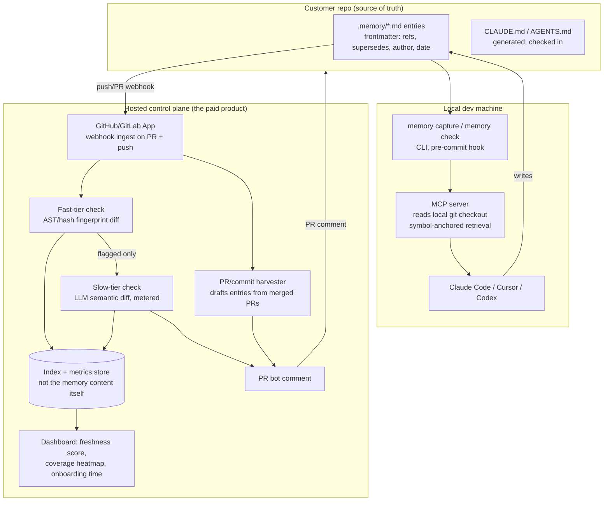

# Project Memory Layer — SaaS Transformation & Architecture Review

2026-09-19 · follow-up to `Project Memory Layer — Idea & Tooling Review.md`

## Headline update: the differentiator moved while you were reading about it

The original review named one thing as the whole ballgame: *"Memory that tells you when it has gone out of date does not [exist yet]."* That is no longer true.

**[projectmem](https://github.com/riponcm/projectmem)** (MIT-licensed, shipped 2026, arXiv paper published) does almost exactly what the original doc scoped as "build second" and "build — this is the edge":

- Native MCP server for Claude Code, Cursor, Codex, and Antigravity — the same multi-tool coverage the original doc wanted from its own MCP server.
- Records issues, attempts, fixes, and decisions as an append-only event log — the same "small append-only files conflict less" design principle the original doc landed on independently.
- **Ships staleness detection**: cross-checks every decision against the git history of the file it cites and flags it — literally "predates 7 commits, confirm or supersede." This is the exact mechanic the original doc proposed building.
- 100% local, no cloud, no telemetry, free.

Separately, **[Swimm](https://swimm.io)** already runs the adjacent pattern — doc-to-code drift flagged as a PR check — as a paid product (~$39/month per team, ≤10 users), proving the "staleness check inside CI" motion is monetizable, just not novel anymore.

This doesn't kill the project. It changes what you're allowed to sell. Section 3 below reframes the opportunity around what projectmem and Swimm still don't do — team-level and org-level governance — rather than around local staleness detection, which is now a commodity you should adopt, not build.

*(Sources for this section and pricing throughout: [projectmem GitHub](https://github.com/riponcm/projectmem), [projectmem v0.1.4 blog](https://projectmem.dev/blog/projectmem-v014-stale-memory-detection-ai-coding-agents/), [Swimm](https://swimm.io/blog/how-swimms-github-app-works), [Swimm pricing](https://www.saasworthy.com/product/swimm-io/pricing).)*

---

## 1. Architecture review — gaps in the original design

The original six-component design is a good cut list, but it stops at "what to build," not "how it behaves under load." These are the gaps that would surface in the first month of real usage.

| Gap | Why it bites | Fix |
| --- | --- | --- |
| **Staleness mechanism is named, not designed** | "Detect when memory is out of date" is a goal, not an algorithm. Two very different systems both satisfy that sentence: a cheap file-hash check and an expensive LLM semantic check. Cost, false-positive rate, and CI latency differ by 100x between them | Two-tier check: (1) fast tier — hash/AST-fingerprint the symbols a memory entry cites (`refs: [src/billing.ts#calculateTax]` in frontmatter); any change trips a flag for free, on every PR. (2) Slow tier — only for flagged entries, one LLM call comparing the entry's claim against the actual diff to write the PR comment. This is what keeps the paid tier's LLM bill proportional to actual drift, not to PR volume |
| **No retrieval design** | The doc correctly flags "context rot" and "token cost" as risks and says "retrieve a few entries, never inject the whole store" — but never specifies how retrieval picks which few. Keyword match, embedding search, and symbol-graph lookup fail differently | Default to symbol/path-linked retrieval (an entry surfaces when the agent touches a file/symbol it cites) as the primary mechanism, with embedding search as a fallback for entries with no code anchor (e.g., "why we chose Postgres over Mongo"). Anchored retrieval is cheaper, explainable, and immune to embedding-model drift across tool vendors |
| **No versioning/conflict model** | "Small append-only files conflict less" is true for git merges, it is not a semantic conflict model. Two developers can both write non-conflicting-in-git, contradictory-in-meaning entries about the same decision | Entries get an explicit `supersedes: <entry-id>` field, written either by the author or proposed by the staleness bot. A contradiction isn't a merge conflict, it's a supersede proposal that shows up as a PR comment for a human to accept — same review motion developers already trust for code |
| **No governance/lifecycle model** | "A contractor should not see everything" is listed as a medium risk with "repo permissions do the work" as the whole answer. That only works if memory never leaves the repo it's about. The moment you build a cross-repo dashboard (which the SaaS pivot requires), repo-level ACLs stop being sufficient | RBAC at the org layer, scoped per-repo, enforced by the hosted control plane — separate from git permissions, because the control plane is where cross-repo aggregation happens |
| **Capture is framed as a binary choice** | The doc correctly kills the raw-session-transcript extractor, but treats "one command, typed in your own words" as the only remaining capture path. That still depends on someone remembering to run it | Add a third, low-risk capture source the original doc doesn't consider: **structured artifacts that already exist** — PR descriptions, merge commit messages, review comments, linked ticket titles. These are already human-written, already reviewed, and already timestamped. An LLM drafts a candidate memory entry from a merged PR; the author gets a one-click "save to memory" / "discard" prompt at merge time. It's not the extractor (no undocumented vendor formats, no session data) and it's not pure manual capture either — it rides on a review step that was going to happen anyway |
| **No product telemetry for the thing you're actually selling** | The doc's own success metric — time to a new developer's first correct non-trivial change — is exactly right, but there's no design for capturing it. Without instrumentation, this is a metric you measure once by hand, not a feature you can put in a dashboard and charge for | Track it as a real product signal: first commit timestamp per new git author + memory-entry-view events in the MCP server, surfaced as a per-repo trend line. This metric, reported back to the customer, is the retention hook — it's the number that justifies renewal |
| **Single-repo framing throughout** | Every component assumes "the repo." Real engineering orgs above ~20 developers split work across many repos and many services, and decisions ("why we don't retry webhook deliveries") often apply org-wide, not to one repo | Org-level entries live in a designated shared repo (or a `.memory/org/` namespace) and get pulled into every repo's retrieval scope by the MCP server config, not copy-pasted |

---

## 2. What the original scorecard should say now

Two dimensions move; the rest hold.

| Dimension | Original | Updated | Why |
| --- | --- | --- | --- |
| Novelty | 4/10 | **3/10** | projectmem ships the staleness mechanic the doc called novel. Swimm ships the "drift flagged in CI" motion commercially. Both closed after the review, not before it — the doc's own "check current docs, this moves fast" caveat was correct |
| Differentiation | 6/10 | **4/10 at the memory+staleness layer, 6/10 at the team/org layer** | The local, single-repo version of this idea is now a commodity — free, OSS, MIT-licensed, multi-tool. The differentiation that survives is everything projectmem is explicitly *not*: hosted, cross-repo, cross-team, with governance and analytics. That's a narrower business than the original framing, but it's a real one |
| Everything else | unchanged | unchanged | The problem is still real (9/10), still chronic-not-acute (6/10), phases 1–2 are still easy, the extractor is still the piece to cut |

**The strategic conclusion this forces:** don't compete with projectmem or basic-memory. Interoperate with them (read their event log / memory file format as one of several capture sources) and sell the layer above — the thing a single developer running a local MCP server structurally cannot want or build: a hosted, cross-repo, multi-seat control plane with a bill an engineering director signs.

---

## 3. Product vision

> **The governance layer for AI-assisted codebases.** Every team already has developers running Claude Code, Cursor, or Codex with some form of local memory — increasingly projectmem or a hand-rolled `CLAUDE.md`. None of that memory talks across repos, across developers, or up to engineering leadership. We are the control plane that aggregates it, keeps it honest, and proves it's working.

This is deliberately narrower than "build a memory system." The memory system is being commoditized in public, in real time, by OSS. The durable business is **observability and governance over memory that already exists**, sold to the people who own onboarding time and audit risk, not to the individual developer who can get 80% of the value for free today.

---

## 4. Target users

| Segment | Who | What they buy | Why they buy it |
| --- | --- | --- | --- |
| **Primary buyer** | VP Eng / Head of Platform / Staff+ eng at a 30–300 person engineering org, heavy AI-coding-agent adoption already in place | Team plan: hosted staleness bot + cross-repo dashboard + onboarding analytics | Owns the pain in the original doc's own success metric — time to a new hire's first correct change — and can be shown a number that moves |
| **Primary user** | Individual engineers, especially first 90 days on a repo, or engineers who move between AI tools | Free/OSS local tooling (generator, capture command, local staleness check) | Same tool works whichever agent they're on this week — the doc's own "switch back to Codex" scenario |
| **Secondary — bottom-up wedge** | Small startups, OSS maintainers | Free tier, GitHub Action / PR bot on public repos | Top-of-funnel; these teams will never pay, but they're distribution and credibility (same motion Greptile used for its free tier) |
| **Tertiary — compliance buyer** | Platform/DevEx or security teams at regulated companies (fintech, healthcare) already burned by an AI agent making an undocumented decision | Enterprise: audit log, SSO, secret-scan gate, self-host/VPC | Needs an answer to "how do we know what our AI agents decided and why" for an audit, not for productivity |

---

## 5. Core features by tier

Interoperate, don't reinvent: the free tier should be able to *read* a projectmem or basic-memory store directly, not force a migration.

| Tier | Features | Analogue in the market |
| --- | --- | --- |
| **Free / OSS** | `AGENTS.md`/`CLAUDE.md` generator · memory file spec · capture CLI (`memory capture`, one command at task end) · local staleness check (`memory check`, fast-tier only, runs pre-commit) · reads projectmem/basic-memory stores natively | Matches what projectmem already gives away — this tier's job is not to lose to free, it's to be the on-ramp |
| **Team ($/seat/month, billed via GitHub/GitLab Marketplace)** | Hosted staleness bot as a PR check (fast tier free, slow/LLM tier metered) · cross-repo dashboard (freshness score, coverage heatmap, stale-entry queue) · onboarding brief generator, exportable per new hire · PR/commit passive-harvest suggestions (draft memory entries from merged PRs) · Slack notifications | Positioned between Swimm ($39/team/mo flat) and Greptile ($30/seat/mo) |
| **Enterprise (custom, annual)** | SSO/SAML · RBAC scoped per repo · audit log of every memory read/write · secret-scan gate (wraps gitleaks/trufflehog — never rebuilt) before any entry persists · self-host / VPC deployment · org-wide multi-repo knowledge graph · policy controls (retention, redaction) | Matches the shape of Zep Enterprise (SOC2/HIPAA/GDPR, SSO, BYOK) and Cody Enterprise, both of which concentrate their entire paid surface here |

---

## 6. Pricing strategy

Grounded in current comps (pulled 2026-09-19):

| Product | Model | Price |
| --- | --- | --- |
| [mem0](https://mem0.ai) | Metered on memory ops, not seats | Free (10k memories) → $19/mo → $249/mo → custom |
| [Zep](https://www.getzep.com) | Metered on message/episode credits | Free (10k msgs) → ~$99–125/mo → custom (SOC2/HIPAA/GDPR, SSO) |
| [Swimm](https://swimm.io) | Flat per team | $39/mo for ≤10 users |
| [Greptile](https://greptile.com) | Per seat + overage | Free (50 reviews/mo) → $30/seat/mo + $1/review → custom |
| [Sourcegraph Cody](https://sourcegraph.com/cody) | Per seat, enterprise-only since mid-2025 | ~$59/seat/mo (killed self-serve entirely) |
| [GitHub Copilot](https://github.com/features/copilot) | Per seat + AI credits | Business $19/seat/mo → Enterprise $39/seat/mo |

Two lessons from this table matter more than any single number:

1. **Sourcegraph Cody's retreat from self-serve to enterprise-only is a warning, not an anecdote.** "Code intelligence, sold bottom-up to individual developers" has already failed once at a funded company in this exact category. Don't repeat it — the original doc's own "narrow willingness to pay" instinct (4/10 commercial viability) is corroborated, not contradicted, by the comps.
2. **Nobody in this table prices the local/individual layer above ~$20/seat**, and the ones that try to (Cody) do it only at the enterprise tier with compliance features attached, not for raw capability. Price the Team tier accordingly — it's paying for the dashboard and the bot, not for memory itself, which is free everywhere including from us.

**Recommendation:**

- **Free**: $0, uncapped, self-hosted. This is not a loss-leader trick — it's simply matching what projectmem already gives away, so there is no wedge for a competitor to underprice you on the thing that's already commoditized.
- **Team**: **$8–12/active developer/month** (billed monthly via GitHub/GitLab Marketplace, no annual lock-in), undercutting Swimm and Greptile because the core memory layer is free and this tier is purely the hosted bot + dashboard. Add metered overage only for the slow-tier (LLM) staleness checks beyond a generous included quota — mirrors GitHub's own September 2026 shift to an included-credits-plus-overage model for Copilot, which suggests the market has just standardized on this shape.
- **Enterprise**: custom, anchored around **$25–35/seat/month** or a flat platform fee for >200 seats, unlocked only by compliance features (SSO, audit, self-host) — never by capability gates, since capability is free.
- Land-and-expand motion: free CLI + a PR-bot comment that mentions "3 more stale entries across the org — see them at [dashboard link]" is the entire top-of-funnel. No outbound needed for the first hundred logos.

---

## 7. Technical architecture

Git stays the source of truth for memory content — that was the original doc's best call and reversing it would throw away the trust and portability advantage. The SaaS surface is a control plane that reads git, never a replacement for it.

Key decisions this diagram encodes:

- **The hosted store is an index and metrics cache, not a copy of the memory content.** The control plane processes diffs and webhooks; it doesn't need to permanently store customer source. This matters for the sales conversation with security-conscious buyers and keeps the "git-backed" trust story intact even once a cloud service exists.
- **Two-tier checking keeps LLM spend proportional to actual drift**, not to PR volume — the fast tier is free and runs on every PR; the slow (metered) tier only fires on entries the fast tier already flagged.
- **The harvester writes drafts, never commits.** Every entry that reaches git went through a human "save" click, which is the same trust mechanism the original doc used to kill the raw-transcript extractor — applied here to a much safer input (PR text, not session logs).
- **Retrieval stays anchored, not injected.** The MCP server serves entries when an agent touches a referenced file/symbol; it does not dump the store into context on every turn, which is the direct fix for the "context rot" and "token cost" risks the original doc flagged.

---

## 8. Roadmap

Each phase has an explicit go/no-go gate — the original doc's discipline ("ship week 1 before designing week 4") carried forward, with the projectmem finding changing what week 1 actually is.

| Phase | Timeframe | Ships | Go/no-go gate before next phase |
| --- | --- | --- | --- |
| **0 — Evaluate, don't build** | Week 1 | Run projectmem and/or basic-memory on your own repo for two weeks. Decide adopt vs. fork vs. ignore | If projectmem's format and MCP integration fit, you inherit components 1–4 for free and skip straight to Phase 2 |
| **1 — OSS on-ramp** | Weeks 2–3 | `AGENTS.md`/`CLAUDE.md` generator, capture CLI, compatible with projectmem's memory format if adopted | Are entries actually being written by week 3, by real developers, without you nagging them? If not, stop — this is the original doc's own kill signal |
| **2 — Hosted MVP, design partners only** | Weeks 4–9 | GitHub App, fast-tier staleness bot as PR comments, minimal dashboard (freshness score + stale queue). 3–5 design partners, free, in exchange for weekly feedback | Do design partners' engineers say the PR comments are useful, or do they mute the bot within two weeks? Muting = write friction / trust problem, same failure mode the original doc warned about |
| **3 — Paid Team tier** | Months 3–4 | Slow-tier LLM check (metered), PR/commit harvester, onboarding brief export, Slack integration, GitHub Marketplace billing | First 10 paying teams. Track the original doc's own metric — new-hire time-to-first-correct-change — before and after; if it doesn't move, the product doesn't have a renewal story yet |
| **4 — Cross-repo + Enterprise** | Months 5–8 | Multi-repo dashboard, RBAC, audit log, SSO, secret-scan gate wired to gitleaks/trufflehog | First enterprise contract signed with compliance features, not capability, as the reason cited |
| **5 — Hardening** | Months 9–12 | SOC2 Type I, self-host/VPC option, org-wide policy controls | Ongoing — this phase doesn't end, it's the enterprise cost of doing business |

**Never build:** the raw session-transcript extractor, and a home-grown secret scanner — both calls from the original doc still hold and nothing found in this review changes them.

---

## 9. Risks carried forward, plus one new one

The original risk table's three human-not-technical risks (rot, write friction, trust) are unchanged and remain the actual product-design problem, not the SaaS-business problem. One risk is new:

| Risk | Status | Mitigation |
| --- | --- | --- |
| Memory rots, nobody maintains it | Unchanged, high | Staleness bot + low write friction, per original doc |
| Write friction | Unchanged, high | One command + passive PR/commit harvesting as a second, lower-effort capture path (Section 1) |
| Trust — can't tell decision from hallucination | Unchanged, high | Provenance on every entry (who, when, from what), unchanged from original doc |
| **A well-funded OSS project (or a funded competitor) adds the team/org layer this plan is betting on** | **New** | This is the real competitive risk now, not "someone builds local memory." Move fast on the hosted layer, and consider contributing to / partnering with projectmem rather than racing it — a co-opted OSS project is a moat, a competing one is a threat |
| Bottom-up devtool pricing fails (Cody precedent) | New, informed by comps | Price the free tier to win adoption, concentrate revenue at the team-admin/compliance layer where Cody, Zep, and Copilot all ended up regardless of where they started |

---

## 10. Bottom line

Build less than the original doc scoped, and build it one layer higher than originally planned.

- **Don't build**: local memory storage, local staleness detection, an MCP server from scratch. projectmem already ships this, free, MIT-licensed, multi-tool. Evaluate it in week 1 before writing any of your own storage or detection code.
- **Do build**: the hosted control plane — PR-bot staleness comments, cross-repo dashboard, onboarding analytics, passive PR/commit harvesting, and the enterprise governance features (SSO, audit, RBAC) that no local-first OSS tool will ever want to build, because they're server-side by nature.
- **Sell to**: engineering leadership, on a per-repo/per-org governance and analytics story — not to individual developers, who can already get most of the value for free and always will.
- **Prove it with**: the original doc's own metric, unchanged — time to a new developer's first correct non-trivial change. If this SaaS doesn't move that number for design partners in Phase 2, no amount of enterprise polish in Phase 4 will save it.

Sources: [projectmem (GitHub)](https://github.com/riponcm/projectmem) · [projectmem v0.1.4 staleness blog](https://projectmem.dev/blog/projectmem-v014-stale-memory-detection-ai-coding-agents/) · [Swimm](https://swimm.io/) · [Swimm pricing](https://www.saasworthy.com/product/swimm-io/pricing) · [mem0 pricing](https://theaiagentindex.com/agents/mem0) · [Zep pricing](https://theaiagentindex.com/agents/zep) · [Greptile pricing](https://stackpick.net/tools/greptile/) · [Sourcegraph Cody pricing](https://weavai.app/blog/en/2026/04/30/sourcegraph-cody-review-2026-enterprise-ai-at-59-mo/) · [GitHub Copilot pricing](https://www.cloudzero.com/blog/github-copilot-enterprise-pricing/)
